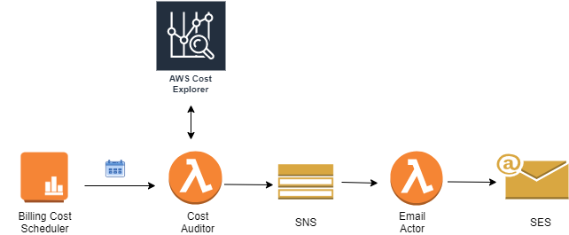

#### AWS Cost Explorer

#### Architecture Diagram



```
TODO :

Schedule a lambda to trigger every Day for following :
  - Get Cost report for a AWS service
  - Send email to specific DL for total Unblended cost for a specific Service say AWS Glue
```
```sh
#!/usr/bin/env python3

import boto3
import datetime
import re

from email.mime.text import MIMEText
from email.mime.application import MIMEApplication
from email.mime.multipart import MIMEMultipart

from botocore.exceptions import ClientError


def lambda_handler(event, context):
    # Create a Cost Explorer client
    client = boto3.client('ce')

    # Set time range to cover the last full calendar month
    # Note that the end date is EXCLUSIVE (e.g., not counted)
    now = datetime.datetime.utcnow()
    # Set the end of the range to start of the current month
    end = datetime.datetime(year=now.year, month=now.month, day=1)
    # Subtract a day and then "truncate" to the start of previous month
    start = end - datetime.timedelta(days=1)
    start = datetime.datetime(year=start.year, month=start.month, day=1)
    # Get the month as string for email purposes
    month = start.strftime('%Y-%m')

    # Convert them to strings
    #start = start.strftime('%Y-%m-%d')
    #end = end.strftime('%Y-%m-%d')
    results = []
    tsv_lines = []
    now = datetime.datetime.utcnow()
    start = (now - datetime.timedelta(days=30)).strftime('%Y-%m-%d')
    end = now.strftime('%Y-%m-%d')
    data = client.get_cost_and_usage(TimePeriod={'Start': start, 'End':  end}, Granularity='DAILY', Metrics=['UnblendedCost'], GroupBy=[{'Type': 'DIMENSION', 'Key': 'LINKED_ACCOUNT'}, {'Type': 'DIMENSION', 'Key': 'SERVICE'}])
    results += data['ResultsByTime']
    email_str = '\t'.join(['TimePeriod', 'LinkedAccount', 'Service', 'Amount', 'Unit', 'Estimated'])
    total_amount = 0.0000
    for result_by_time in results:
        for group in result_by_time['Groups']:
            if 'AWS Glue' in group['Keys']:
                amount = group['Metrics']['UnblendedCost']['Amount']
                unit = group['Metrics']['UnblendedCost']['Unit']
                line = result_by_time['TimePeriod']['Start'] , '\t' , '\t'.join(group['Keys']), '\t', str(amount), '\t', str(unit), '\t', str(result_by_time['Estimated'])
                email_str = email_str + ''.join(line)+ '\n'
                total_amount = total_amount + float(amount)
                #print(group)
                #print(email_str)
    email_str = email_str + ''.join(line)+ '\n\n\t' + 'Total Cost AWS Glue : ' + str(total_amount) + '\n'
    send_email(month, email_str)


def send_email(month, attachment):
    msg = MIMEMultipart()
    msg['From']  = "Ashutosh Mishra <ashu.beginner@gmail.com>"
    msg['To'] = "ashu.beginner@gmail.com"
    msg['Subject'] = "Monthly AWS Cost Breakdown: {}".format(month)

    # what a recipient sees if they don't use an email reader
    msg.preamble = 'Multipart message.\n'

    # the message body
    part = MIMEText('Here is the aws billing data from last month.' + '\n' + str(attachment))
    msg.attach(part)

    # the attachment
    #part = MIMEApplication(attachment)
    print(attachment)
    #part.add_header('Content-Disposition', 'attachment', filename="AWS-MonthlyCostByProject-{}.tsv".format(month))
    #msg.attach(part)

    # Create an AWS Simple Email Service (SES) client
    client = boto3.client('ses', region_name='us-west-2')

    #try:
    response = client.send_raw_email(
        RawMessage={
             'Data': msg.as_string(),
        },
        Source=msg['From'],
        Destinations=[msg['To']]
    )
    # Display an error if something goes wrong.
    #except ClientError as e:
    #    print(e.response['Error']['Message'])
    #else:
    #print("Email sent! Message ID:"),
    #print(response['ResponseMetadata']['RequestId'])


if __name__ == "__main__":
    lambda_handler({}, {})
```
