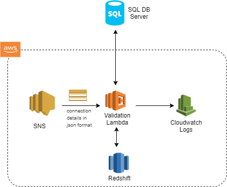

#### DMS Data Migration Validation

```
This is to validate source and destination databases post migration
```

During data migration there is always a possibility of missing data or data corruption. Therefore, it is necessary to test whether the whole data set migrated successfully, looking at both historical and incremental data migration. Incremental loading, in particular, can be challenging because each database has its own structure. This makes it important to test that the fields and jobs are loaded correctly and that files are not corrupted.

To ensure both historical and incremental data is successfully migrated, requires running several validation tests, including:

##### Schema Validation
During data migration it is necessary to validate the schema, such as stored procedures, views, or user preferences as part of the data migration. However, as previously discussed, with thousands of tables, manually validating schema is too time-consuming. Therefore, it is necessary to automate the process by writing a script that can reveal any mismatches between the source and the target. By automating this process, you can export target metadata into a final table where the data can be compared with source metadata to identify any data mismatches prior to run time.

Cell-by-Cell Comparison using QuerySurge
Testing at this level of detail guarantees full validation of the data, helping to avoid time-consuming and expensive data quality issues often discovered in after a data migration. Automation is also essential for this type of testing and can be done using QuerySurge (see How to Ensure a Successful Data Migration: Assessment and Automation Strategies).

For starters, QuerySurge has enough database capacity to store intermediate results in order to join and compare the data from the source and target databases throughout the testing process. Secondly, QuerySurge provides detailed comparison results, highlighting data mismatches.

The one limitation with QuerySurge however, is that it does not pinpoint exactly where a data mismatch is located such as what column or cell it is in. However, this issue is easily overcome by writing a utility on top of the QuerySurge tool, which allows you to then automatically and quickly detect the specific location of data mismatches.

##### Reconciliation Checks
One of the most important aspects of validation is performing reconciliation checks on the source and target databases for all columns. This ensures that the data is not corrupted, date formats are maintained, and that the data is completely loaded.

As previously stated, given the size of the data being migrated, a manual process is not feasible. Additionally, manual reconciliation of missing columns can result in the removing columns that change the structure of the data. For these reasons, automation is once again required.

To automate the process, use a Unix shell script to create a list of tables in the text file to be tested and then exported the text file as parameter to the shell. As the script scans, it will pick up numeric columns from a particular table and will create sequels from all numeric columns. Later it will take those sequels, execute it, and store the results in a file. All steps should be performed on both the source database and the target database. Once finished, you can compare both the files generated on the source and target database to identify the mismatches.

##### NULL Validation
NULL validation is necessary to ensure the NULL is not accidently inserted in place of valid data. Automating this process is similar to other validation testing and requires writing an automation script to validate the count of nullable and non-nullables values present in the same columns between the source and target databases.

##### Ad Hoc Testing
The final step in the testing process, ad hoc testing ensures that the target business application and the newly migrated data are able to successfully process the data. Ad hoc testing may, therefore, include running a business query from customer or examining important data or frequently used tables to ensure that the source and target data match and the data migrated successfully.

##### Non-Functional Testing
One should also include non-functional testing of architectural components at different testing levels to validate system operations, including:

##### Security Validation 
– Security testing helps determine whether all the security user roles have successfully migrated to new database to prevent unauthorized user access to the system data. It includes the validation of tables, views, stored procedures, and functions.
Performance or Benchmark Testing – Benchmark testing helps identify if there is any impact on new/modified architectural components while fetching the data on the new system. Benchmark testing compares the workflow/job execution time in parallel loading, the complex query execution time, and the execution time between large table queries on the source and target databases. If possible, the best way to make comparisons is through running a report data query on both databases and then compare query execution time.
Following these strategies and testing procedures during your data migration project will help ensure that the migration goes smoothly. Not only helping to eliminate business disruptions due to flawed execution, but also saving time over manual processes, and ensuring that the entire project maintains its timeline—thereby avoiding expensive cost overruns.

#### Architecture Diagram



##### Loading data from SQL Server to Python pandas dataframe

```
import pandas as pd
import pyodbc

sql_conn = pyodbc.connect('DRIVER={ODBC Driver 13 for SQL Server};
                            SERVER=SQLSERVER2017;
                            DATABASE=Adventureworks;
                            Trusted_Connection=yes') 
query = "SELECT [BusinessEntityID],[FirstName],[LastName],
                 [PostalCode],[City] FROM [Sales].[vSalesPerson]"
df = pd.read_sql(query, sql_conn)

df.head(3)
```
